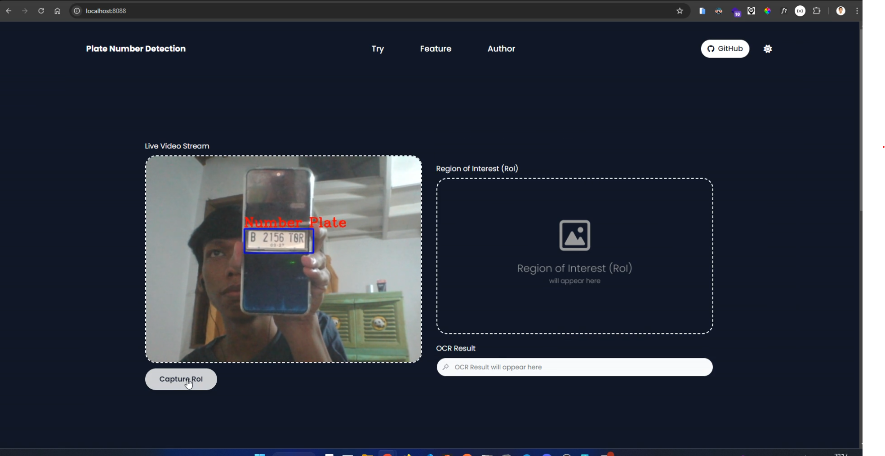

<h1 align="center">Django Plate Number Detection</h1>

<div align="center">

&nbsp;
&nbsp;
&nbsp;
&nbsp;
&nbsp;

</div>



<p align="center">This repository is web application that aims to provide various features such as video live stream, haarcascade classifier, and optical character recognition (OCR). This app is built using Python, OpenCV, Django, TailwindCSS (django-tailwind), EasyOCR</p>

## Table of Contents

-   [Demo Application](#demo-app)
-   [Tech Stack](#tech-stack)
-   [Running on Localhost](#running-on-localhost)
-   [Troubleshooting Error](#troubleshooting-error)
    -   [Commons](#commons)
        -   [Live Video Stream Camera Not Detecting](#live-video-stream-camera-not-detecting)
        -   [OpenCV imshow The function is not implemented](#opencv-imshow-the-function-is-not-implemented)
    -   [Windows](#windows)
        -   [PyTorch Library fbgem.dll](#pytorch-library-fbgemdll)
        -   [OMP: Error #15: Initializing libiomp5md.dll](#omp-error-15-initializing-libiomp5mddll-but-found-libomp140x86_64dll-already-initialized)
-   [Credits](#credits)

## Demo App


## Tech Stack

-   [Python](https://www.python.org) (`Programming Language`): Python is a high-level, interpreted programming language known for its simplicity and versatility, widely used in web development, data analysis, artificial intelligence, scientific computing, and more.
-   [OpenCV](https://opencv.org) (`Computer Vision`): OpenCV (Open Source Computer Vision Library) is an open-source computer vision and machine learning software library. It provides a comprehensive set of features for image processing, computer vision, and machine learning.
-   [Django](https://www.djangoproject.com) (`Framework`): Django is a high-level Python web framework that encourages rapid development and clean, pragmatic design. It is designed to help developers build robust and scalable web applications quickly.
-   [TailwindCSS](https://tailwindcss.com) (`CSS Framework`): TailwindCSS is a utility-first CSS framework for building custom user interfaces rapidly and efficiently. It provides a comprehensive set of CSS utility classes that allow developers to design directly in their markup.
-   [EasyOCR](https://github.com/JaidedAI/EasyOCR) (`OCR`): EasyOCR is a ready-to-use Optical Character Recognition (OCR) library built with deep learning techniques. It can handle text in different languages and is designed for high accuracy and performance.

## Running on Localhost

1. Clone this repository

```bash
git clone https://github.com/armandwipangestu/django-plate-number-detection.git && cd django-plate-number-detection
```

2. Install `python-virtualenv` (in my case use `Arch Linux`) and create the virtual environment

> **NOTE**: If you are using windows you can install with anaconda, then create the virtual environment
>
> ```ps
> conda create -n django-plate-number-detection python==3.8
> ```

```bash
sudo pacman -S python-virtualenv
```

```bash
virtualenv django-plate-number-detection
```

3. Activate the virtual environment to the current shell session

> **NOTE**: If you are using windows and anaconda, to activate the virtual environment use this command instead
>
> ```ps
> conda activate django-plate-number-detection
> ```

```bash
source django-plate-number-detection/bin/activate
```

4. Install dependency required library

```bash
pip install -r requirements.txt
```

5. Install dependency tailwindcss library

```bash
python manage.py tailwind install
```

6. Running application & tailwindcss

> **NOTE**: Running this server with seperate shell session

```bash
python manage.py runserver 0.0.0.0:8080
```

```bash
python manage.py tailwind start
```

After the server running, open this url `http://localhost:8080` on your web browser

## Troubleshooting Error

### Commons

#### Live Video Stream Camera Not Detecting

If you got this error, just reload the page browser, sometimes it likes to error (I don't know why, but if reload it it will be normal)

#### OpenCV imshow The function is not implemented

> **NOTE**: This error will not appear on this application, this error will appear if you use the `imshow` function on opencv library

If you got this error message `cv2.error: OpenCV(4.10.0) /io/opencv/modules/highgui/src/window.cpp:1301: error: (-2:Unspecified error) The function is not implemented. Rebuild the library with Windows, GTK+ 2.x or Cocoa support. If you are on Ubuntu or Debian, install libgtk2.0-dev and pkg-config, then re-run cmake or configure script in function 'cvShowImage'`, just run this command

```bash
pip uninstall opencv-python-headless opencv-python
```

```bash
pip install opencv-python
```

After uninstall and install the library, just run the app again

### Windows

#### PyTorch Library fbgem.dll

> **NOTE**: `${PATH_TO_ENV}` is dynamic location, it depends on your installation either using conda or virtualenv

If you got error the PyTorch library like this `OSError: [WinError 126] The specified module could not be found. Error loading "${PATH_TO_ENV}/lib/site-packages/torch/lib/fbgem.dll" or one of its dependencies` when running the application. You can read this forums, it's like the PyTorch library doesn't have `libomp140.x86_64.dll` file. So you can download the file and place it to the same location `fbgem.dll`

-   Discuss PyTorch - Failed to import pytorch fbgemm.dll or one of its dependencies is missing: [#22](https://discuss.pytorch.org/t/failed-to-import-pytorch-fbgemm-dll-or-one-of-its-dependencies-is-missing/201969/22)
-   Discuss PyTorch - Failed to import pytorch fbgemm.dll or one of its dependencies is missing: [#23](https://discuss.pytorch.org/t/failed-to-import-pytorch-fbgemm-dll-or-one-of-its-dependencies-is-missing/201969/23)
-   DLLme - libomp140.x86_64.dll: [Download](https://www.dllme.com/dll/files/libomp140_x86_64/00637fe34a6043031c9ae4c6cf0a891d/download)

#### OMP: Error #15: Initializing libiomp5md.dll, but found libomp140.x86_64.dll already initialized.

> **NOTE**: That is dangerous, since it can degrade performance or cause incorrect results. The best thing to do is to ensure that only a single OpenMP runtime is linked into the process, e.g. by avoiding static linking of the OpenMP runtime in any library. As an unsafe, unsupported, undocumented workaround you can set the environment variable KMP_DUPLICATE_LIB_OK=TRUE to allow the program to continue to execute, but that may cause crashes or silently produce incorrect results. For more information, please see http://www.intel.com/software/products/support/.

If you got this error, you can add this code at file `manage.py`

```python
import os
os.environ["KMP_DUPLICATE_LIB_OK"]="TRUE"
```

## Credits

-   Damar Satria Buana
    -   YouTube Video - [Deteksi Plat Nomor Algoritma Haarcascade Classifier dan OCR | Tugas Besar Daspro Python](https://youtu.be/teGvW4rmOYc?si=WfLgbIEIIoNrYQFG)
    -   GitHub Repository 1 - [number-plate-detection-updated](https://github.com/notsatria/number-plate-detection-updated)
    -   GitHub Repository 2 - [DeteksiPlatNomor](https://github.com/notsatria/DeteksiPlatNomor)
-   Sanket Sawardekar
    -   YouTube Video - [Stream Live Video used in Django using OpenCV](https://youtu.be/KUoNQ-44-1k?si=Fmf07_PbsCmREaqd)
    -   GitHub Repository - [Django_VideoStream](https://github.com/sawardekar/Django_VideoStream)
